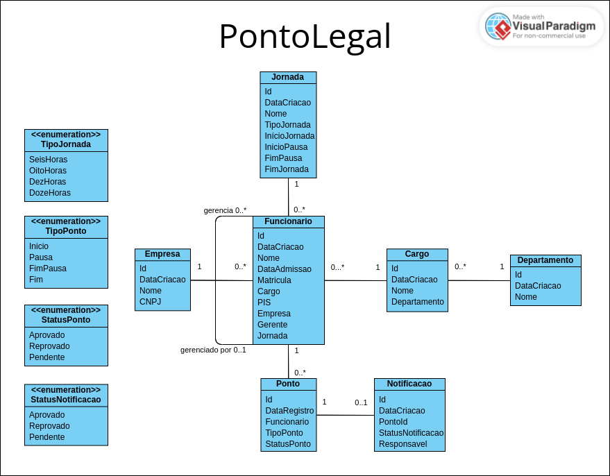

# PONTO LEGAL

## Escopo
Escrever uma API utilizando a tecnologia .NET para desenvolvimento de um sistema para controle de funcionários através da abordagem TDD.

## Requisitos
**Cadastro de Funcionários:** Deve haver um módulo para cadastro de funcionários da empresa, incluindo informações como nome, cargo, departamento, e número de identificação.

**Controle de Horário:** O sistema deve calcular automaticamente as horas trabalhadas com base nos registros de entrada e saída de funcionários. levando em consideração regras de horário, como horas extras e intervalos obrigatórios.

**Aprovação de Ponto:** Um sistema de aprovação pode ser necessário, onde os supervisores ou gerentes revisam e aprovam os registros de ponto dos funcionários.

## Diagrama


## Comandos Úteis
### Migration
- Adicionar
```
dotnet-ef migrations add "Nome da migration" --project <nome__projeto_de_dados> -s <nome_projeto_principal(API)> --verbose
```

- Atualizar o Banco
- ```
dotnet-ef database update --project <nome__projeto_de_dados> -s <nome_projeto_principal(API)> --verbose
```
```
Obs: -s igual a --startup-project
```
